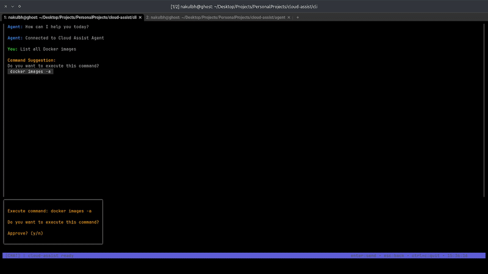

# Cloud-Assist: AI DevOps Terminal Agent


An intelligent terminal-based DevOps assistant powered by AI. Simply describe what you want to accomplish in plain language, and Cloud-Assist will suggest the right commands, execute them with your approval, and help you complete complex infrastructure tasks.

## 🎥 Demo



*Watch Cloud-Assist in action: Interactive terminal interface with real-time AI assistance for DevOps tasks.*

## ✨ What It Does

**Talk to your terminal like a DevOps expert**
- Describe tasks in natural language: *"Set up monitoring for my web service"*
- Get contextually appropriate command suggestions
- Review and approve each command before execution
- AI analyzes output and suggests next steps
- Maintains context throughout your session

**Perfect for:**
- Cloud infrastructure setup and management
- Kubernetes cluster operations
- Application deployment and troubleshooting
- Docker container management
- System monitoring and debugging

## 🏗️ Architecture

Cloud-Assist consists of two main components:

**🤖 AI Agent** (Python + LangGraph)
- Powered by LangGraph for complex reasoning workflows
- Supports multiple AI models (OpenAI, Anthropic, etc.)
- Maintains conversation context and command history
- Analyzes command output and suggests next steps

**💻 Terminal CLI** (Go + Bubble Tea)
- Beautiful terminal user interface
- Secure command approval workflow
- Real-time communication with AI agent
- Session management and history

```
┌─────────────────┐    WebSocket    ┌──────────────────┐
│   Terminal CLI  │ ◄──────────────► │   AI Agent       │
│   (Go/BubbleTea)│                  │   (Python/       │
│                 │                  │    LangGraph)    │
└─────────────────┘                  └──────────────────┘
         │                                     │
         ▼                                     ▼
   User Approval                        AI Model APIs
   Command Execution                    (OpenAI, etc.)
```

## 💡 Example Workflow

```
👤 You: "My nginx server is returning 503 errors"

🤖 Cloud-Assist: "Let me help troubleshoot your nginx 503 errors. 
                  First, let's check if nginx is running:"

   💻 Suggested: systemctl status nginx
   
   ✅ [Execute] ❌ [Skip] ❓ [Explain] 🚪 [Quit]

👤 You: ✅

🤖 Cloud-Assist: "Nginx is running but upstream servers are down. 
                  Let's check your backend services..."
```

## 🤝 Contributing

This project is under active development. Contributions, feedback, and suggestions are welcome!

## 📄 License

MIT License - Built with ❤️ for DevOps engineers who value both automation and control.